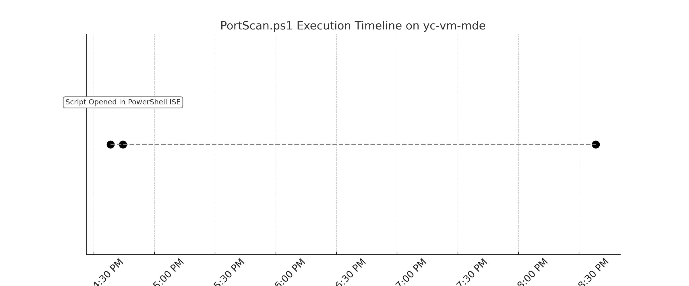

# Threat Hunt: Internal Port Scanning via PowerShell (`portscan.ps1`)

## Scenario Overview
The server team at Acme Corp reported noticeable network slowdowns on older devices within the `10.0.0.0/16` subnet. External DDoS was ruled out. The security team suspected internal scanning or large file transfers as the source of degradation.

> **Hypothesis**: A device on the internal network is performing unauthorized port scans using PowerShell.

---

## 2. Data Collection
The following tables were queried:
- `DeviceProcessEvents`
- `DeviceNetworkEvents`
- `DeviceFileEvents`

Primary device of interest: **`yc-vm-mde`**

---

## 3. Data Analysis & Findings

### Suspicious Command Detected:
```powershell
powershell.exe -ExecutionPolicy Bypass -File C:\programdata\portscan.ps1
```

### File Behavior:
- File: `portscan.ps1`
- Folder: `C:\ProgramData\` (commonly abused for evasion)
- Opened via `PowerShell_ISE.exe`
- Executed via `powershell.exe` twice

### Execution Timeline:



---

## 4. Network Behavior

From `DeviceNetworkEvents`:

| Timestamp          | Process         | Connections | Unique Ports | Unique Targets |
|-------------------|-----------------|-------------|---------------|----------------|
| June 1, 2025 4PM  | `portscan.ps1`  | 4           | 4             | 1              |
| June 7, 2025 4PM  | `portscan.ps1`  | 4           | 4             | 1              |

This confirms scanning activity targeting internal IPs over multiple ports.

---

## 5. MITRE ATT&CK Mapping

| Technique                  | ID         | Description                        |
|---------------------------|------------|------------------------------------|
| Command and Scripting Interpreter | T1059.001 | PowerShell                         |
| Network Service Scanning  | T1046      | Discovery of open ports on hosts   |
| Hide Artifacts            | T1564.001  | Use of uncommon folder (ProgramData) |

---

## 6. Response

### Actions Taken:
- Confirmed malicious intent behind the script
- Script path and process were flagged
- Device `yc-vm-mde` isolated for further forensic review

---

## 7. Lessons & Improvements

| Area            | Improvement Suggestion                                 |
|-----------------|--------------------------------------------------------|
| Policy Gaps     | Disable unrestricted use of PowerShell in production   |
| Detection       | Alert on abnormal use of `ProgramData` + port scan keywords |
| Training        | Train users/admins to recognize unauthorized script behavior |
